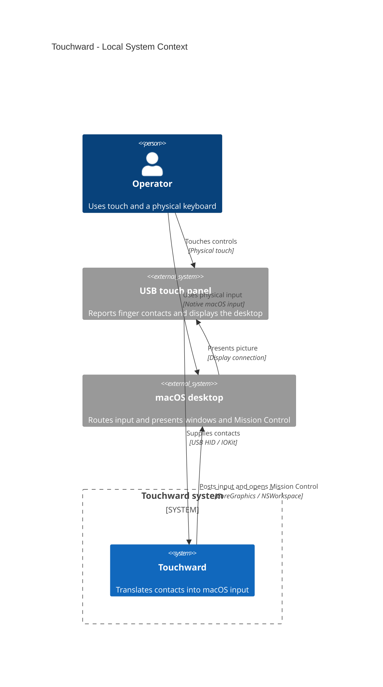

# Touchward System Context

## Scope

The custom Touchward system and its direct interactions. Internal Swift types belong
below this level. The author check uses the package definition, application entry point,
event synthesizer, and upstream documentation. Two-finger desktop navigation posts
Control-arrow shortcuts through the input path. Two-finger double-tap opens the native
Mission Control app through `NSWorkspace`.

## Legend

The boundary encloses the software under review. External systems and the operator sit
outside it. Arrows name the purpose and mechanism of each interaction.

## Assumptions

macOS already presents a picture on the panel. The app has the required Accessibility and
HID access. The physical mouse and keyboard retain their native input path.

## Open Questions

The runtime topology is established. Physical acceptance of PDF-163's new gesture and
keyboard behavior is pending and is not certified by this view.

## Accessible Description

The operator touches the panel. Its HID digitizer sends contacts to Touchward, which posts
macOS input events or opens Mission Control. macOS displays the resulting windows on the
panel. The operator's physical keyboard and mouse reach macOS directly.
