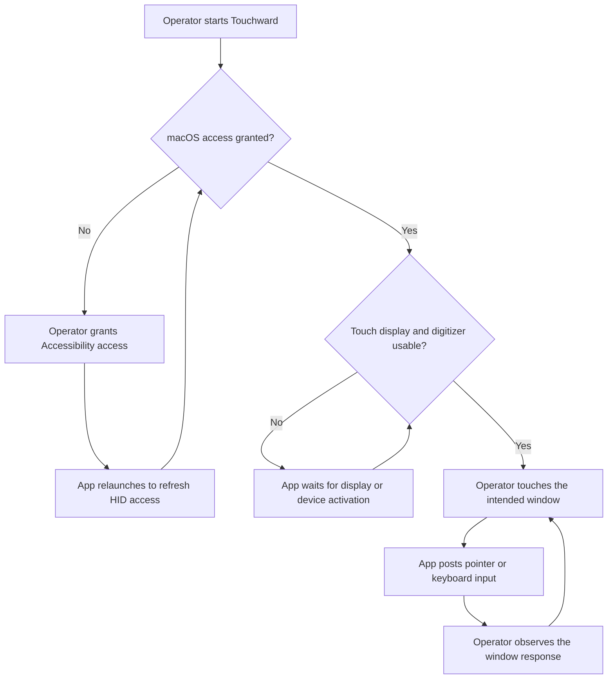

# Touchward Primary Journey

## Scope

The custom app's activation and interaction path, checked against `main.swift` and
`EventSynthesizer.swift`. With the keyboard preference disabled, focusing a text field
does not construct or show the panel; the physical keyboard remains available. Desktop
swipes use macOS Control-arrow shortcuts. This is a user journey, not a detailed gesture
algorithm or a claim of hardware acceptance.

## Legend

Rectangles are operator or app actions; diamonds are readiness checks. Arrow labels name
the branch taken. A return arrow means the app continues waiting or processing.

## Assumptions

The Mac already displays the intended window on the panel. The app has selected the
correct display. The operator can use the physical keyboard while touch is being set up.

## Open Questions

Edward has confirmed baseline two-finger scrolling. PDF-163's desktop navigation and
disabled-keyboard behavior still require physical testing on the custom build.

## Accessible Description

The operator starts the app. If permission is missing, macOS settings and an app relaunch
establish access. The app then waits for a usable display and digitizer. Touches produce
input in macOS, and the operator verifies the visible response. A working process alone
does not establish that the desired gesture feels or behaves correctly.
