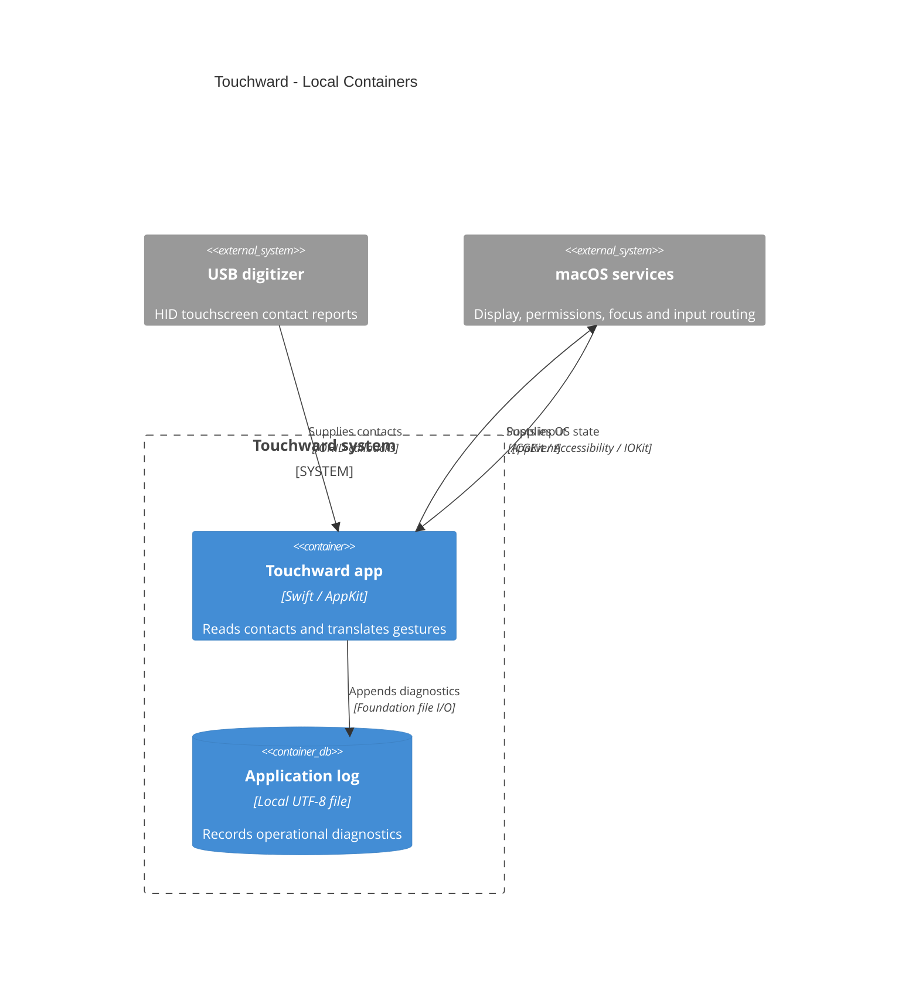

# Touchward Containers

## Scope

There is one app process and one diagnostic file, with no separately deployed service.
`TouchwardCore` is a library linked into that process, not another container. When enabled,
the app's keyboard panel is also part of that process. `main.swift` reads the local
`OnScreenKeyboardEnabled` UserDefaults preference and skips keyboard construction when
false. The package definition and `main.swift` establish these boundaries at the verified
commit. Desktop swipes post Control-arrow key events through the same event synthesizer.

## Legend

The system boundary encloses the app and its local log. The cylinder is a local file, not
a database service. External boxes are the touch hardware and macOS APIs. Directed arrows
name the exchanged information or action.

## Assumptions

One Touchward process owns the selected digitizer. Local UserDefaults supplies the
keyboard preference, whose default is true. App bundle identity and installation state
are recorded separately in current state.

## Open Questions

Custom-build signing, Accessibility grant, and physical acceptance must be verified during
installation. This view establishes the runtime boundary rather than those outcomes.

## Accessible Description

The digitizer streams touch values to one Swift app. macOS supplies display, permission,
and focus information. The app posts input events back to macOS and writes diagnostics to
a local log file. Pure gesture logic and the optional on-screen keyboard execute inside
the same app process; the disabled preference prevents keyboard construction.
